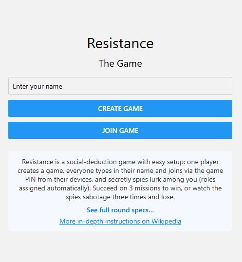
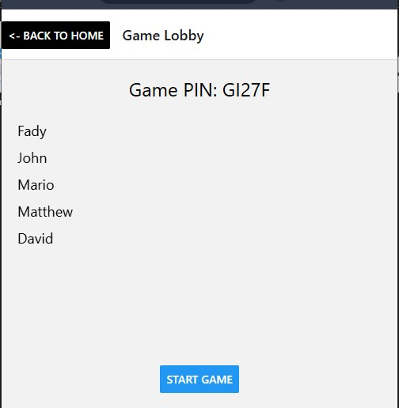
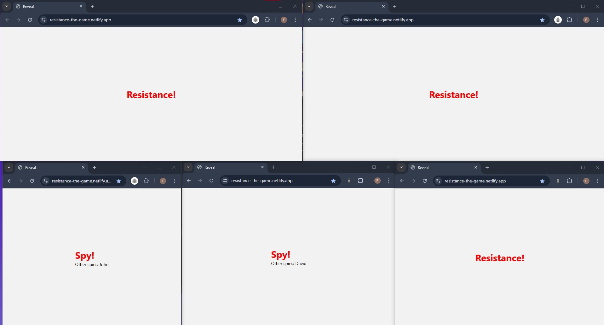
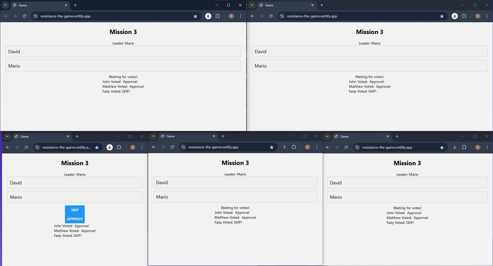

# Resistance

A real-time social-deduction game built as a web app using Node.js, Socket.IO and Expo (React Native).

Play as Resistance operatives or hidden spies, complete missions, and outwit your friends—all through your browser or mobile device.

---

## 🔗 Live Demo

[Play the game now!](https://resistance-the-game.netlify.app/)

---

## 🛠 Technologies Used

- **Backend**: Node.js (v20), Express, Socket.IO  
- **Frontend**: React Native (Expo for Web)  
- **Real-Time**: WebSockets via Socket.IO  
- **Hosting**:  
  - Frontend on Netlify  
  - Backend on Raspberry Pi 5 (Nginx reverse proxy + SSL)  
- **Others**:  
  - JavaScript (ES6+)  
  - CSS for styling  

---

## 🚀 Getting Started

### Prerequisites

- Node.js v20  
- npm (or Yarn)  
- Git  

### Installation

1. **Clone the repo**  
   ```bash
   git clone https://github.com/your-username/resistance-game.git
   cd resistance-game
   ```

2. **Install & Start the Server**
   ```bash
   cd server
   npm install
   npm start
   ```
   This will start the backend on `http://localhost:5000`.

3. **Install & Start the Client**
   ```bash
   cd ../client
   npm install
   npm start
   ```
   This runs the frontend in your browser using Expo for Web, usually at `http://localhost:19006`.

---

## 🎮 How to Play

1. **Create a Game**  
   One player selects **Create Game** to start a session and generate a game PIN.

2. **Join a Game**  
   Other players enter their name and the PIN to join the session.

3. **Start the Game**  
   Once enough players have joined, the host starts the game. Roles are randomly assigned (Resistance or Spy).

4. **Gameplay**  
   - Each round, a team leader is chosen to propose a mission crew.
   - All players vote to approve or reject the proposed team.
   - If approved, selected players secretly vote to succeed or sabotage the mission.
   - The outcome is revealed, and the next round begins.

5. **Winning**  
   - **Resistance** wins if **3 missions succeed**.  
   - **Spies** win if **3 missions are sabotaged**.  

*Advanced rules such as two required sabotages in round 4+ with 7+ players are supported.*

---

## 📸 Screenshots

<p align="center">
  
  
  
  
</p>

---

## ⚙️ Deployment Details

- **Frontend**:  
  Hosted on Netlify with CI/CD enabled for every push to `main`.

- **Backend**:  
  Deployed on a Raspberry Pi 5 using PM2 and Nginx as a reverse proxy with an SSL certificate.

- **Domain**:  
  Configured via Namecheap and pointed to the Pi's public IP.


---


## 🙌 Acknowledgments

- Inspired by the original *The Resistance* board game  

